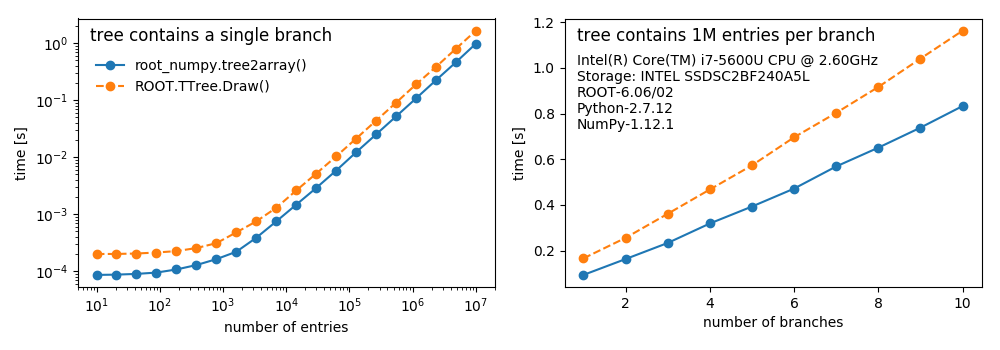

# Summary

root_numpy [@root_numpy_repo] is a Python extension module providing an
interface between CERN's ROOT software framework [@ROOT] and NumPy [@NumPy].
root_numpy enables researchers typically operating within the C++ domain of
ROOT to analyse data in ROOT format within the broad and growing ecosystem of
scientific Python packages.

At the core of root_numpy are functions for converting a ROOT `TTree` into a
structured NumPy array as well as converting a NumPy array back into a ROOT
`TTree`. root_numpy can convert `TTree` branches (columns) of basic types such
as bool, int, float, double, etc. and strings, as well as variable-length and
fixed-length multidimensional arrays and 1D or 2D (nested) `std::vector<>`s of
basic types and strings. root_numpy can also create columns in the output NumPy
array that are mathematical expressions involving the `TTree` branches in the
same way as ROOT's `TTree::Draw()`. root_numpy's internals are compiled C++ and
can therefore handle large amounts of data much faster than equivalent pure
Python implementations.

# References
